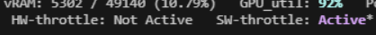
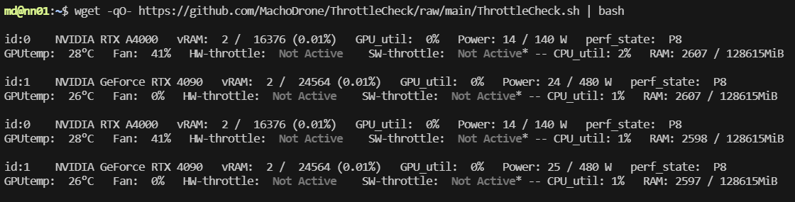

# Check GPU Temp Throttling

***While running a job***, copy and paste this entire command to your bash shell and it will update every 10 seconds.

If you see Not Active change to Active, then you are Temperature-Throttled.

```wget -qO- https://github.com/MachoDrone/ThrottleCheck/raw/main/ThrottleCheck.sh | bash```

Example of a GPU throttled by Temperature



